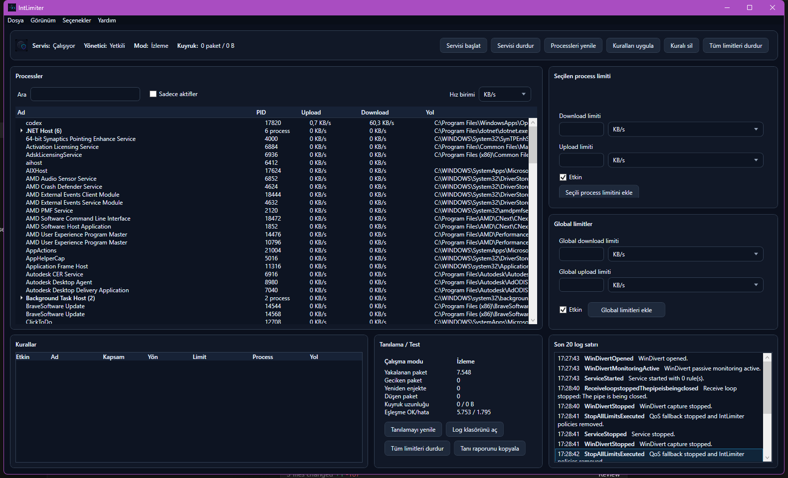

# IntLimiter

IntLimiter, Windows 10/11 x64 için geliştirilen NetLimiter benzeri bir bant genişliği izleme ve limit uygulama MVP'sidir. Uygulama global ve process bazlı upload/download limitleri tanımlayabilir, WinDivert ile paket yakalama ve token bucket temelli geciktirme yapar.



## Özellikler

- Global download ve upload limiti
- Process bazlı download ve upload limiti
- Canlı process trafik takibi
- Process gruplama ve hız birimi seçimi
- WinDivert tabanlı gerçek paket yakalama
- Windows Service + WPF Client mimarisi
- JSONL log ve tanılama paneli
- Türkçe / İngilizce dil seçimi
- Aydınlık / karanlık / sistem teması

## Mimari

```text
src/
  IntLimiter.Client       WPF masaüstü arayüzü
  IntLimiter.Service      Arka plan Windows Service
  IntLimiter.Core         Ortak modeller, IPC, rule store, token bucket
  IntLimiter.DriverBridge WinDivert ve QoS fallback katmanı
  IntLimiter.Setup        Tek dosyalık custom installer
tests/
  IntLimiter.Core.Tests
docs/
  RESEARCH.md
  ARCHITECTURE.md
  MVP_LIMITATIONS.md
  TESTING.md
```

Client uygulaması her açılışta yönetici izni ister. Service de yönetici yetkisiyle çalışır; bunun nedeni WinDivert ve ağ trafiği şekillendirme işlemlerinin normal kullanıcı yetkisiyle güvenilir şekilde yapılamamasıdır.

## Gereksinimler

- Windows 10 veya Windows 11 x64
- .NET 8 SDK
- Yönetici yetkisi
- WinDivert 2.2 dosyaları:
  - `WinDivert.dll`
  - `WinDivert64.sys`

WinDivert dosyaları local geliştirme için şu klasöre konmalıdır:

```text
third_party/WinDivert/x64/
```

## Build

```powershell
dotnet restore .\IntLimiter.sln
dotnet build .\IntLimiter.sln
dotnet test .\IntLimiter.sln --no-build
```

## Setup Oluşturma

```powershell
.\scripts\build-installer.ps1
```

Setup çıktısı:

```text
dist/installer/IntLimiterSetup.exe
```

Setup, client ve service dosyalarını paketler, WinDivert dosyalarını dahil eder, Windows Service'i kurar ve masaüstü kısayolu oluşturur.

## Hızlı Test

Önce uygulamayı kurup açın. Ardından limitsiz download ölçümü alın:

```powershell
.\scripts\run-speed-test.ps1 -Direction Download -Mode Before
```

UI içinde global download limitini örneğin `512 KB/s` yapıp kuralları uygulayın:

```powershell
.\scripts\run-speed-test.ps1 -Direction Download -Mode After
```

Runtime doğrulaması:

```powershell
.\scripts\verify-intlimiter-runtime.ps1
```

Başarılı testte packet counter değerleri artmalı, limit açıkken hız düşmeli ve limit kaldırılınca bağlantı normale dönmelidir.

## Bilinen Sınırlar

- MVP seviyesi bir projedir.
- Ana hedef IPv4/TCP trafiğidir.
- UDP ve IPv6 desteği sınırlıdır.
- Process eşleştirme Windows IP Helper tablolarına dayanır; çok kısa ömürlü bağlantılar kaçabilir.
- QoS fallback yalnızca outbound/upload tarafında anlamlıdır.
- Profesyonel sürüm için uzun vadeli doğru çözüm imzalı WFP callout driver mimarisidir.

Detaylı araştırma ve test notları `docs/` klasöründedir.
